# Hospital Management System - Class Diagram

```mermaid
classDiagram
    direction TB

    class Person {
        -string name
        -string phone
        +void SetName(string value)
        +void SetPhone(string value)
        +string GetName()
        +string GetPhone()
    }

    class Patient {
        +string PatientID
        +int Age
        +string Gender
        +string Password
        +void CreatePatient(string id, string name, int age, string gender, string phone, string password)
    }

    class Doctor {
        +string DoctorID
        +string Username
        +string Specialty
        +string Password
        +int Age
        +int ExperienceYears
        +int CertificationsCount
        +void CreateDoctor(string id, string username, string name, string specialty, string phone, string password, int age, int experience, int certifications)
    }

    class Appointment {
        +string AppointmentID
        +string PatientID
        +string DoctorID
        +DateTime AppointmentDate
        +AppointmentStatus Status
        +string Diagnosis
        +void CreateAppointment(string id, string patientID, string doctorID, DateTime appointmentDate, AppointmentStatus status, string diagnosis)
    }

    class AppointmentStatus {
        <<enum>>
        Pending
        Completed
        Cancelled
    }

    class DB {
        <<static>>
        +Doctor[] Doctors
        +Patient[] Patients
        +Appointment[] Appointments
        +int DoctorCount
        +int PatientCount
        +int AppointmentCount
        +string AdminPassword
        +string GenerateMixedID()
        +void Save()
        +void Load()
        +int FindPatientByID(string id)
        +int FindPatientByNameAndPassword(string name, string password)
        +int FindDoctorByLogin(string username, string password)
        +int FindPatientByNameAndPhone(string name, string phone)
        +int FindDoctorByID(string id)
        +int FindAppointmentByDoctorAndTime(string doctorID, DateTime time)
        +int CountAppointmentsForPatient(string patientId)
        +void GetDistinctSpecialties(string[] result, out int count)
        +void DeleteDoctorByIndex(int doctorIndex)
        +void DeletePatientByIndex(int patientIndex)
        +void RemoveAppointmentAt(int index)
    }

    class ValidationHelper {
        <<static>>
        +bool IsValidFullName(string input)
        +bool IsValidTextOnly(string input)
        +bool IsValidEgyptianPhone(string input)
    }

    class MainForm
    class StaffLoginForm
    class AdminLoginForm
    class DoctorLoginForm
    class PatientLoginForm
    class PatientRecoverForm
    class PatientRegistrationForm {
        +Patient RegisteredPatient
    }
    class BookingEntryForm {
        +Patient SelectedPatient
    }
    class SpecialtySelectionForm {
        -Patient currentPatient
        +string SelectedSpecialty
    }
    class DoctorSelectionForm {
        -Patient currentPatient
        -string selectedSpecialty
        +Doctor SelectedDoctor
    }
    class AppointmentDateTimeForm {
        -Patient currentPatient
        -Doctor selectedDoctor
    }
    class BookingConfirmationForm
    class AdminForm
    class DoctorEditForm {
        -Doctor doctor
    }
    class DoctorForm {
        -Doctor currentDoctor
    }
    class PatientDashboardForm {
        -Patient currentPatient
    }
    class PatientAccountForm {
        -Patient currentPatient
        +bool AccountDeleted
    }

    Person <|-- Patient
    Person <|-- Doctor

    Appointment --> AppointmentStatus
    DB --> Doctor
    DB --> Patient
    DB --> Appointment

    PatientRegistrationForm --> Patient
    BookingEntryForm --> Patient
    SpecialtySelectionForm --> Patient
    DoctorSelectionForm --> Patient
    DoctorSelectionForm --> Doctor
    AppointmentDateTimeForm --> Patient
    AppointmentDateTimeForm --> Doctor
    BookingConfirmationForm --> Appointment
    BookingConfirmationForm --> Doctor
    DoctorEditForm --> Doctor
    DoctorForm --> Doctor
    PatientDashboardForm --> Patient
    PatientAccountForm --> Patient

    MainForm --> BookingEntryForm
    MainForm --> PatientLoginForm
    MainForm --> StaffLoginForm

    StaffLoginForm --> AdminLoginForm
    StaffLoginForm --> DoctorLoginForm

    AdminLoginForm --> AdminForm
    DoctorLoginForm --> DoctorForm
    PatientLoginForm --> PatientDashboardForm
    PatientLoginForm --> PatientRecoverForm

    BookingEntryForm --> PatientRegistrationForm
    BookingEntryForm --> SpecialtySelectionForm
    SpecialtySelectionForm --> DoctorSelectionForm
    DoctorSelectionForm --> AppointmentDateTimeForm
    AppointmentDateTimeForm --> BookingConfirmationForm
    PatientDashboardForm --> PatientAccountForm

    MainForm ..> DB
    AdminForm ..> DB
    DoctorForm ..> DB
    PatientDashboardForm ..> DB
    PatientAccountForm ..> DB
    BookingEntryForm ..> DB
    PatientLoginForm ..> DB
    PatientRecoverForm ..> DB
    PatientRegistrationForm ..> DB
    SpecialtySelectionForm ..> DB
    DoctorSelectionForm ..> DB
    AppointmentDateTimeForm ..> DB

    PatientRegistrationForm ..> ValidationHelper
    PatientLoginForm ..> ValidationHelper
    PatientRecoverForm ..> ValidationHelper
    AdminForm ..> ValidationHelper
    DoctorEditForm ..> ValidationHelper
```

## Notes

- `Person` is the base class for `Patient` and `Doctor`.
- `DB` is the central static storage/service class for loading, saving, searching, and deleting records.
- The booking flow is:
  `MainForm -> BookingEntryForm -> SpecialtySelectionForm -> DoctorSelectionForm -> AppointmentDateTimeForm -> BookingConfirmationForm`
- The patient flow is:
  `MainForm -> PatientLoginForm -> PatientDashboardForm -> PatientAccountForm`
- The staff flow is:
  `MainForm -> StaffLoginForm -> AdminLoginForm/AdminForm` or `DoctorLoginForm/DoctorForm`

